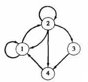
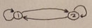
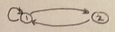
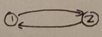
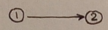
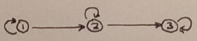
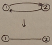
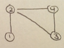

# Relations

---

## Table of Contents

01. [Relations](#relations)
02. [Digraphs](#digraphs)
03. [Paths](#paths)
03. [Properties of relations](#properties-of-relations)

---

## Relations

* **relation** from a set $A$ to set $B$ is subset of $A \times B$
    * each element of $A \times B$ represented by ordered pair $(a, b)$
* if $R \subseteq A \times B$ and $(a, b) \in R$, then $a$ is related to $b$ by $R$

 

* $a$ being related to $b$ by $R$: $a \, \text{R} \, b$
* $a$ not being related to $b$ by $R$: $a \, \not{\text{R}} \, b$.

 

* **domain** of $R$ ($\text{dom}\{R\}$) is set of elements in $A$ which are related to an element in $B$
* **range** of $R$ ($\text{range}\{R\}$) is set of elements in $B$ which form an ordered pair with an element in $A$.

 

* $R$ represented by $m \times n$ matrix $\textbf{M}_{\textbf{R}}$:

\begin{equation*}
m_{ij} =
\begin{cases}
1 \quad \text{if } (a_{i}, b_{i}) \in R \\
0 \quad \text{if } (a_{i}, b_{i}) \notin R \\
\end{cases}
\end{equation*}

---

[(back to top)](#table-of-contents)

---

## Digraphs

* a relation matrix can be represented by a **directed graph** (**digraph**)
    * elements of $A$ and $B$ are vertices
    * an edge from one vertex to another (with an arrow indicating direction) exists only if $m_{ij} = 1$
* **in-degree** of a vertex $a$ is amount of directed edges leading to $a$
* **out-degree** of a vertex $a$ is amount of directed edges coming out of $a$

 

* the following produces the digraph below:

\begin{equation*}
A = \{1, 2, 3, 4\}
\end{equation*}
\begin{equation*}
R = \{(1, 1), (1, 2), (2, 1), (2, 2), (2, 3), (2, 4), (3, 4), (4, 1)\}
\end{equation*}

 

* **restriction of $R$ to $B$** is $R \cup B \times B$ when $B \subseteq A$

---

[(back to top)](#table-of-contents)

---

## Paths

* a path of length n from elements $a$ to $b$ in set $A$ is such that:

\begin{equation*}
a \, R \, x_{1}, x_{1} \, R \, x_{2}, \dots, x_{n - 1} \, R \, b
\end{equation*}

* paths are not necessarily distinct
    * follows the directions of arrows in digraphs
* paths that begin and end at same vertex called **cycles**
    * 1 to 2 to 3 is a cycle:
    * 1 to 2 to 1 is a cycle:
    * 2 to 3 is not a cycle:
    * 2 to 3 to 3 is not a cycle:

* $a \, R^{n} \, b$ represents path of length $n$ from $a$ to $b$ in $R$
    * $a \, R^{\infty} \, b$ means that there exists some path that will eventually lead $a$ to $b$

 

* given that $\textbf{M}_{\textbf{R}} = [m_{ij}]$ represents the relation matrix of $R$
    * $m_{ij} = 1$ if $a_{i} \, R \, a_{j}$ exists
    * $R^{n}$ is represented by $\textbf{M}_{\textbf{R}}^{n}$

 

#### Theorem: traversing digraph using matrices

For $n \ge 1$:

\begin{equation*}
\textbf{M}_{\textbf{R}^{\textbf{n}}} = \textbf{M}_{\textbf{R}}^{n}
\end{equation*}

where $R$ is a relation on set $A$.

**End theorem.**

 

* **reachability** ($R^{*}$) means that either:
    * $x \, R^{*} \, y$
    * $x = y$
* given $\pi_{1} = a, x_{1}, \dots, x_{n - 1}, b$ and $\pi_{2} = b, y_{1}, \dots, y_{m - 1}, c$, the **composition** of $\pi_{1}$ and $\pi_{2}$ is:

\begin{equation*}
a, x_{1}, \dots, x_{n - 1}, b, y_{1}, \dots, y_{m - 1}, c
\end{equation*}

* where the path is of length $n + m$

 

* **inverse path** is a path defined in reverse:

\begin{equation*}
\pi^{-1} = b, x_{n - 1}, \dots, x_{1}, a
\end{equation*}

* inverse path may not be in $R$, given $R$ is digraph
	* the inverse of 1 to 2 (2 to 1) exists:
	* the inverse of 3 to 1 (1 to 3) does not exist:

---

[(back to top)](#table-of-contents)

---

## Properties of relations

* relation is **reflexive** if $a \, R \, a$ for all $a \in A$
	* $(a, a) \in R$ for all $a$
	* reflexive relation:

* relation is **irreflexive** if $a \, \not{\text{R}} \, a$ for all $a \in A$
	* if all $(a, a) \notin R$, relation is irreflexive
	* if at least one $(a, a) \in R$, relation is not irreflexive
	* irreflexive relation:

 

* examples of relations:
	* equality relation: $\Delta = \{(a, a) \: | \: a \in A\}$
		* reflexive
	* inequality relation: $R = \{(a, b) \in A \times A \: | \: a \neq b\}$
		* irreflexive
	* empty relation: $R = \emptyset \subseteq A \times A$
		* irreflexive

 

* reflexive relations have:
	* 1's along main diagonal in relation matrix
	* cycle of length 1 at every vertex
	* $\Delta \subseteq R$
* irreflexive relations have:
	* 0's along main diagonal in relation matrix
	* no cycles of length 1
	* $\Delta \cap R = \emptyset$

 

* relationship is **symmetric** if $a R b$ and $b R a$ exist
	* for relation matrix: $m_{ij} = m_{ji}$
	* $\textbf{M}_{\textbf{R}} = \textbf{M}_{\textbf{R}}^{T}$

* relationship is **asymmetric** if either $a R b$ and $b R a$ do not exist
	* for relation matrix: if $m_{ij} = 1$ then $m_{ji} = 0$ and main diagonal are 0's

* relationship is **antisymmetric** if $a R b$ and $b R a$ exist only when $a = b$
	* whenever $a \neq b$, an antisymmetric relationship also needs to be asymmetric
	* for relation matrix: if $i \neq j$ then either $m_{ij} = 0$ or $m_{ji} = 0$

 

* for symmetric relationships, the digraph can be replaced with just one edge between two vertices:
	* type of digraph known as a **graph**

* for asymmetric relationships, each edge goes from vertex $a$ to vertex $b$:
	* each edge known as an **undirected edge**

 

* symmetric relationship is **connected** if $a \: R^{*} \: b$ for $a \in A$ and $b \in A$:

 

* relation is **transitive** if when $a R b$ and $b R c$ then $a R c$
	* composition of $a R b$ and $b R c$ holds true

#### Theorem: transitive property

A relation $R$ is transitive iff there is a path of length greater than 1 from vertex $a$ to vertex $b$. In other words:

\begin{equation*}
R^{n} \subseteq R \quad \text{for} \; n \ge 1
\end{equation*}

**End theorem.**

 

* relation $R$ is **equivalence relation** if it is:
	* reflexive
	* symmetric
	* transitive
* example:

* given equivalence relation, an **equivalence class** is:

\begin{equation*}
[a] = \{x \in A \, | \, x \: R \: a\} \quad \text{for} \; a \in A
\end{equation*}

* equivalence class properties:
	* $[a] = [b]$ iff $a \, R \, b$
	* if $[a] \neq [b]$ then $[a] \cap [b] = \emptyset$

#### Theorem: equivalence class to partition

If $R$ is an equilvance relation on set $A$, then the collection of all equivalence classes of the elements of $A$ gives a partition of $A$, denoted by $A/R$.

**End theorem.**

#### Theorem: partition to equivalence class

Given a partition of set $A$, we can define an equivalence relation $R$ on $A$ so that the corresponding eequivalence classes are hte given blocks of the partition of $A$.

**End theorem.**

---

[(back to top)](#table-of-contents)

---